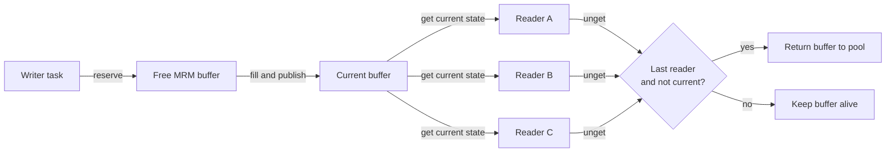

# MRM Usage Pattern — Most-Recent State Publication

The **Most-Recent Message protocol (MRM)** is the RK0 pattern for one writer publishing state to one or more readers when **freshness matters more than history**.

Use it when readers need to answer:

> What is the newest valid state now?

Do not use it when readers must process every message in order. That is a Message Queue requirement.

---

## Problem

A producer updates state at its own rate. Several readers run independently, often at different priorities and periods.

A FIFO queue preserves history. That is useful for work items, commands, and records, but it may be harmful for control state: a slow reader can remain busy processing old samples while newer state already exists.

MRM intentionally does not preserve that backlog for new readers.

---

## What the pattern retains

- the currently published message;
- buffer lifetime while an existing reader still holds that buffer;
- reader counts used to determine when an old buffer can return to the pool;
- bounded storage supplied at initialisation.

## What it discards

- historical backlog for new readers;
- any guarantee that every reader observes every publication;
- producer/consumer lockstep.

A reader may:

- observe the same state more than once;
- miss intermediate publications;
- run at a different rate from the writer.

The important guarantee is that a new read does not begin by draining stale queue history.

---

## Mechanism



The writer reserves a buffer, fills it, and publishes it. Once published, that buffer becomes the only message visible to new readers.

If readers still hold the former current buffer, it remains alive until the final reader calls `kMRMUnget()`. It is no longer visible to new readers.

---

## Buffer-count rule

Provision:

```text
number of MRM buffers = number of communicating tasks + 1
```

For one writer and three readers:

```text
4 communicating tasks + 1 = 5 buffers
```

The extra buffer allows the writer to publish a new state while all communicating tasks may still be associated with existing buffers.

---

## Minimal RK0 example

```c
#include <kapi.h>

#define N_READERS        3U
#define N_COMM_TASKS     (1U + N_READERS) /* one writer + readers */
#define N_MRM_BUFFERS    (N_COMM_TASKS + 1U)

typedef struct
{
    UINT value;
    RK_TICK timestamp;
} STATE_SAMPLE;

static RK_MRM stateMrm;
static RK_MRM_BUF stateMrmBuffers[N_MRM_BUFFERS];
static STATE_SAMPLE statePayloads[N_MRM_BUFFERS] K_ALIGN(4);

static VOID StateMrmInit(VOID)
{
    K_ASSERT(kMRMInit(&stateMrm,
                      stateMrmBuffers,
                      statePayloads,
                      N_MRM_BUFFERS,
                      RK_TYPE_WORD_COUNT(STATE_SAMPLE)) == RK_ERR_SUCCESS);
}

static RK_ERR PublishState(UINT const value)
{
    STATE_SAMPLE sample = {
        .value = value,
        .timestamp = kTickGet()
    };

    RK_MRM_BUF *bufferPtr = kMRMReserve(&stateMrm);
    if (bufferPtr == NULL)
    {
        return RK_ERR_MEM_FREE;
    }

    return kMRMPublish(&stateMrm, bufferPtr, &sample);
}

static RK_BOOL ReadLatestState(STATE_SAMPLE *const samplePtr)
{
    if (samplePtr == NULL)
    {
        return RK_FALSE;
    }

    RK_MRM_BUF *bufferPtr = kMRMGet(&stateMrm, samplePtr);
    if (bufferPtr == NULL)
    {
        return RK_FALSE; /* nothing has been published yet */
    }

    /* samplePtr now contains a copy of the newest published state. */
    K_ASSERT(kMRMUnget(&stateMrm, bufferPtr) == RK_ERR_SUCCESS);
    return RK_TRUE;
}
```

---

## Writer task

```c
static VOID StateWriterTask(VOID *args)
{
    RK_UNUSEARGS

    UINT value = 0U;

    for (;;)
    {
        K_ASSERT(PublishState(value++) == RK_ERR_SUCCESS);
        kSleepRelease(20U);
    }
}
```

The writer does not wait for every reader to consume every publication. It publishes the newest state and continues according to its own timing policy.

---

## Reader tasks with different rates

```c
static VOID FastReaderTask(VOID *args)
{
    RK_UNUSEARGS

    for (;;)
    {
        STATE_SAMPLE sample;

        if (ReadLatestState(&sample) != RK_FALSE)
        {
            UseFastControlState_(&sample);
        }

        kSleepRelease(25U);
    }
}

static VOID SlowReaderTask(VOID *args)
{
    RK_UNUSEARGS

    for (;;)
    {
        STATE_SAMPLE sample;

        if (ReadLatestState(&sample) != RK_FALSE)
        {
            UpdateTelemetry_(&sample);
        }

        kSleepUntil(&telemetryAnchor, 100U);
    }
}
```

The readers may observe different publications because they run at different rates. Neither reader is forced to drain historical data before seeing current state.

---

## Ownership and lifetime rules

1. `kMRMReserve()` returns a buffer for the writer to prepare.
2. The reserved buffer is not visible to readers until `kMRMPublish()` succeeds.
3. `kMRMGet()` copies the current message into reader-owned storage and returns the associated MRM buffer handle.
4. Every successful `kMRMGet()` must be matched by `kMRMUnget()`.
5. A former current buffer returns to the pool only when no reader still holds it.
6. A reader must not retain the returned `RK_MRM_BUF *` beyond the matching `kMRMUnget()`.

---

## When to use MRM

Use MRM for:

- sensor state consumed by several controllers;
- cascaded control loops;
- current vehicle speed, orientation, torque, or position;
- latest configuration/state snapshots;
- telemetry where the newest value is more useful than old queued samples.

Do not use MRM for:

- commands that must all execute;
- transactions requiring acknowledgement;
- logs or audit records;
- ordered work queues;
- request/reply invocation.

Use a Message Queue for preserved history and a Call Channel for synchronous invocation.

---

## Real-time mistake prevented

MRM prevents a slow reader from confusing **old queued data** with **current state**.

A Message Queue asks:

> What have I not processed yet?

MRM asks:

> What is true now?

---

## Related RK0 documentation

- RK0 Docbook: §9.10, *Most-Recent Message Protocol (MRM)*
- RK0 Docbook: §9.10.1.2, *Immediate state transfer — Car Speed*
- RK0 Docbook: §9.10.1.3, *Cascaded Robot Servo
